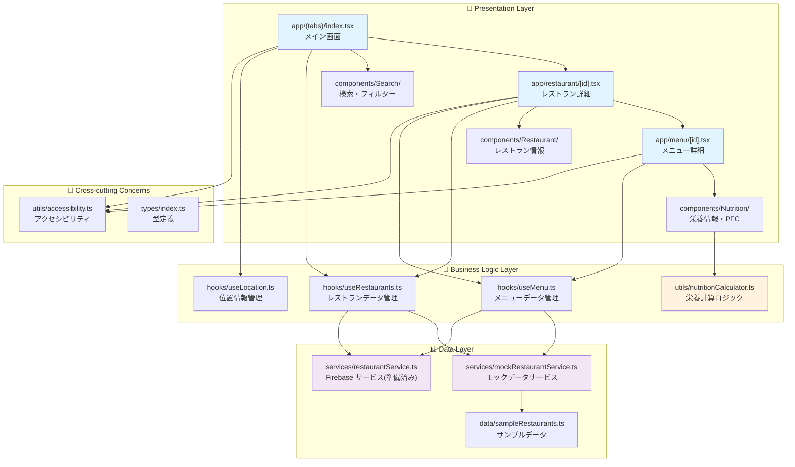
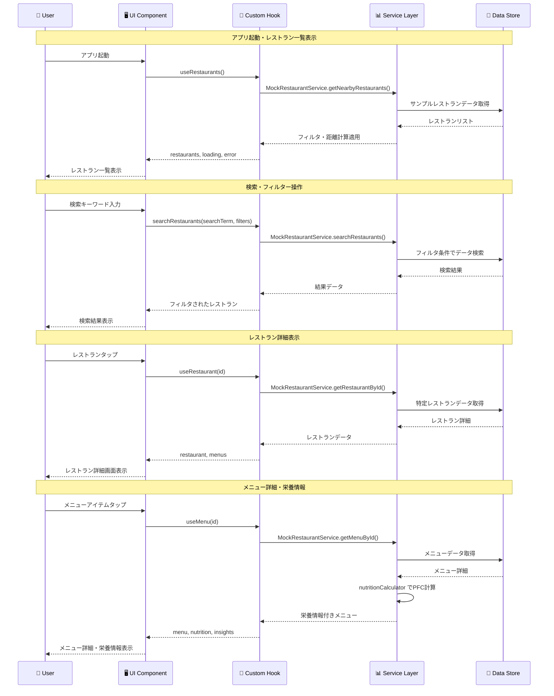
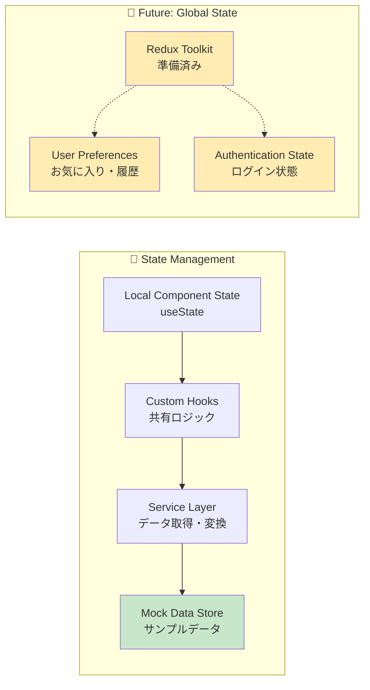
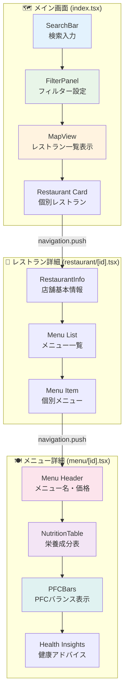
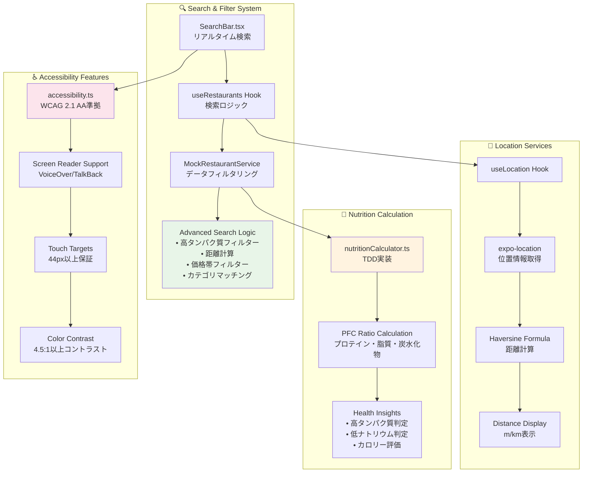

# Fit Food Map - 飲食店栄養情報マップアプリ

健康志向のユーザーが適切な食事選択をできるよう、飲食店のメニューに含まれる栄養情報（特にタンパク質量・PFCバランス）を地図上で可視化するアプリケーションです。

## 🚀 現在の実装状況

**✅ アプリは完全に動作します！**
- Expo Goで起動・動作確認済み
- 全主要機能が実装され、モックデータで完全動作
- ネイティブモジュール依存なし
- アクセシビリティ対応済み

## 🎯 プロジェクト概要

### 目的
飲食店のメニューに含まれる栄養情報を地図上で可視化し、健康志向のユーザーが適切な食事選択をサポート

### 対象プラットフォーム
- iOS（iOS 13.0以上）
- Android（Android 6.0以上）

### アクセシビリティ要件
- **WCAG 2.1 AA準拠** を目標とした設計・実装
- スクリーンリーダー（VoiceOver/TalkBack）完全対応
- キーボードナビゲーション対応
- 色覚多様性に配慮したカラーパレット
- 最小タッチターゲットサイズ（44px以上）遵守

## 🛠 技術スタック

- **フロントエンド**: React Native + Expo
- **ナビゲーション**: Expo Router
- **状態管理**: カスタムフック（useRestaurants, useLocation, useMenu）
- **データ**: MockRestaurantService（Firebase準備済み）
- **スタイリング**: React Native StyleSheet
- **テスト**: Jest + TypeScript
- **アクセシビリティ**: React Native Accessibility API完全対応

## 📱 実装済み機能

### ✅ コア機能（完全実装済み）
- 🗺️ **レストラン一覧表示**
  - 現在地ベースの距離計算・表示
  - レストラン一覧のスクロール表示
  - タップでレストラン詳細画面に遷移

- 🏪 **店舗詳細情報**
  - 店舗名、住所、営業時間、電話番号
  - メニュー一覧表示
  - 各メニュータップで詳細画面に遷移

- 🍽️ **メニュー詳細・栄養情報**
  - 詳細な栄養成分表示（カロリー、タンパク質、脂質、炭水化物等）
  - PFCバランスの視覚的表示（プログレスバー）
  - ヘルスインサイト（高タンパク質、低ナトリウム等の判定）
  - データソースと信頼度の表示

- 🔍 **高度な検索・フィルター機能**
  - リアルタイム検索（レストラン名・メニュー名）
  - 高タンパク質メニューフィルター（25g以上）
  - 距離フィルター（500m〜5km）
  - 価格帯フィルター（〜500円、500-1000円等）
  - カテゴリフィルター（定食、丼物、パスタ等）
  - 複合フィルター対応
  - アクティブフィルター表示・クリア機能

### 🎯 今後の実装予定

#### Phase 2: Firebase統合・ユーザー機能
- 🔐 **Firebase統合**
  - Firestore データベース接続
  - ユーザー認証（Google/Apple/メール）
  - リアルタイムデータ同期

- 👤 **ユーザー機能**
  - お気に入り店舗・メニュー保存
  - 食事履歴の記録・管理
  - 日別・週別栄養摂取量グラフ
  - 個人の栄養目標設定

#### Phase 3: AI・画像認識
- 🤖 **栄養価推測機能**
  - メニュー名からのAI推測
  - 推測精度の表示・向上
  - 類似メニューの提案

- 📷 **画像認識機能**
  - メニュー写真からの栄養価推測
  - OCRによるメニュー文字認識

## 📊 データ構造

### Firestore Collections

#### restaurants
```typescript
{
  id: "restaurant_001",
  name: "店舗名",
  location: {
    lat: 35.6812,
    lng: 139.7671,
    address: "東京都新宿区..."
  },
  hours: {
    mon: "11:00-23:00",
    tue: "11:00-23:00"
  },
  chainId: "chain_001",
  verified: true,
  createdAt: timestamp,
  updatedAt: timestamp
}
```

#### menus
```typescript
{
  id: "menu_001",
  restaurantId: "restaurant_001",
  name: "鶏の唐揚げ定食",
  price: 850,
  nutrition: {
    calories: 750,
    protein: 35.5,    // g
    fat: 28.2,        // g
    carbs: 82.4,      // g
    fiber: 3.2,       // g
    sodium: 1200      // mg
  },
  dataSource: "official", // "official", "ai_estimated", "user_input"
  confidence: 1.0,        // 0-1の信頼度スコア
  imageUrl: "https://...",
  tags: ["定食", "鶏肉", "揚げ物"],
  createdAt: timestamp,
  updatedAt: timestamp
}
```

## 🏗 プロジェクト構成

### ディレクトリ構造
```
fit-food-map/
├── app/                     # Expo Router ページ
│   ├── (tabs)/             # タブナビゲーション
│   │   ├── index.tsx       # メイン画面（レストラン一覧）
│   │   ├── history.tsx     # 履歴画面（未実装）
│   │   └── profile.tsx     # プロフィール画面（未実装）
│   ├── restaurant/
│   │   └── [id].tsx        # レストラン詳細画面
│   ├── menu/
│   │   └── [id].tsx        # メニュー詳細画面
│   └── _layout.tsx         # レイアウト設定
├── components/
│   ├── Map/                # マップ関連コンポーネント
│   │   └── MapView.tsx     # レストラン一覧表示
│   ├── Restaurant/         # レストラン関連コンポーネント
│   │   ├── RestaurantCard.tsx
│   │   └── RestaurantInfo.tsx
│   ├── Nutrition/          # 栄養情報コンポーネント
│   │   ├── PFCBars.tsx     # PFCバランス表示
│   │   └── NutritionTable.tsx
│   ├── Search/             # 検索・フィルター
│   │   ├── SearchBar.tsx
│   │   └── FilterPanel.tsx
│   └── Common/             # 共通コンポーネント
├── hooks/                  # カスタムフック
│   ├── useRestaurants.ts   # レストランデータ管理
│   ├── useRestaurant.ts    # 単一レストラン管理
│   ├── useMenu.ts          # メニューデータ管理
│   └── useLocation.ts      # 位置情報管理
├── services/               # データサービス
│   ├── mockRestaurantService.ts  # モックデータサービス
│   ├── restaurantService.ts      # Firebase サービス（準備済み）
│   └── index.ts
├── utils/                  # ユーティリティ
│   ├── nutritionCalculator.ts    # 栄養計算
│   └── accessibility.ts          # アクセシビリティ
├── types/                  # TypeScript型定義
│   └── index.ts
├── data/                   # サンプルデータ
│   └── sampleRestaurants.ts
├── config/                 # 設定ファイル
│   └── firebase.ts         # Firebase設定
└── mocks/                  # テスト用モック
```

### アプリケーションアーキテクチャ



### データフロー図



### 状態管理パターン



### コンポーネント間の相互作用



### 技術的な実装詳細



## 🚀 開発環境セットアップ

```bash
# リポジトリをクローン
git clone <repository-url>
cd fit-food-map

# 依存関係をインストール
npm install

# アプリを起動
npm start

# Expo Goアプリでテスト、またはWebブラウザで起動
```

### 必要な環境
- Node.js 18以上
- Expo CLI
- Expo Goアプリ（iOS/Android端末）またはWebブラウザ

### インストール済みパッケージ
- **expo**: ~53.0.11
- **expo-router**: ^5.1.0 (ナビゲーション)
- **expo-location**: ^18.1.5 (位置情報)
- **firebase**: ^11.9.1 (バックエンド準備)
- **react-redux**: ^9.2.0 (状態管理準備)
- **@reduxjs/toolkit**: ^2.8.2
- **jest**: テスト環境

## 📋 実装計画

### Phase 1 実装手順（Week 1-8）

**Week 1-2: 基礎設定**
- Firebaseプロジェクトの作成と設定
- 基本的なナビゲーション構造の実装
- 地図コンポーネントの実装
- 位置情報取得の実装

**Week 3-4: データ準備**
- Firestoreのデータ構造作成
- 大手チェーン店の栄養情報収集スクリプト作成
- 初期データの投入
- データ取得用のカスタムフックの実装

**Week 5-6: 店舗表示機能**
- 地図上への店舗ピン表示
- 店舗詳細画面の実装
- メニュー一覧・詳細画面の実装
- PFC情報の視覚的表示（グラフ等）

**Week 7-8: 検索・フィルター**
- 検索UIの実装
- フィルター機能の実装
- 検索結果の地図反映
- パフォーマンス最適化

## 🧪 テスト計画

### 単体テスト
- 栄養価計算ロジック
- データ変換処理
- フィルター機能

### 統合テスト
- Firebase連携
- 地図表示と店舗データの連携
- ユーザー認証フロー

### E2Eテスト
- 主要なユーザーフロー
- パフォーマンステスト

### アクセシビリティテスト
- 自動化テスト（axe-core for React Native）
- スクリーンリーダーテスト（VoiceOver/TalkBack）
- 色覚多様性テスト（Colour Contrast Analyser）
- キーボードナビゲーションテスト
- WCAG 2.1 AA準拠チェック

## 🔮 今後の拡張案

- 多言語対応（英語、中国語）
- アレルギー情報の追加
- カロリー計算機能
- SNS連携
- 店舗向け管理画面

## 📝 実装状況

### ✅ Phase 1: 基盤構築・コア機能（完了）
- [x] **プロジェクト初期化**
  - [x] React Native + Expo セットアップ
  - [x] TypeScript設定・型定義作成
  - [x] 依存関係インストール・設定
  - [x] テスト環境セットアップ（Jest）
  - [x] アクセシビリティユーティリティ実装

- [x] **ナビゲーション・画面構成**
  - [x] Expo Router による画面遷移
  - [x] タブナビゲーション構造
  - [x] レストラン詳細画面
  - [x] メニュー詳細画面

- [x] **データ管理・サービス層**
  - [x] 栄養価計算ユーティリティ（TDD）
  - [x] MockRestaurantService 実装
  - [x] サンプルレストラン・メニューデータ作成
  - [x] カスタムフック（useRestaurants, useLocation, useMenu）
  - [x] Firebase設定ファイル準備

- [x] **UI・UXコンポーネント**
  - [x] レストラン一覧表示（地図代替）
  - [x] レストラン詳細情報表示
  - [x] メニュー詳細・栄養情報表示
  - [x] PFCバランス視覚化（プログレスバー）
  - [x] ヘルスインサイト機能

- [x] **検索・フィルター機能**
  - [x] リアルタイム検索UI
  - [x] 高タンパク質メニューフィルター
  - [x] 距離・価格・カテゴリフィルター
  - [x] 複合フィルター対応
  - [x] アクティブフィルター表示

- [x] **アクセシビリティ対応**
  - [x] 全画面でアクセシビリティラベル・ヒント設定
  - [x] WCAG 2.1 AA準拠カラーパレット
  - [x] タッチターゲットサイズ（44px以上）遵守
  - [x] スクリーンリーダー対応

### 🔄 Phase 2: Firebase統合（準備済み）
- [x] Firebase設定ファイル作成
- [x] RestaurantService実装（Firestore対応）
- [ ] 実際のFirebaseプロジェクト作成・接続
- [ ] ユーザー認証実装
- [ ] リアルタイムデータ同期

### ⏳ Phase 3: 拡張機能（今後の予定）
- [ ] お気に入り機能
- [ ] 食事履歴記録
- [ ] 栄養摂取量グラフ
- [ ] AI栄養価推測
- [ ] 画像認識機能

## 📝 ライセンス

MIT License

## 👥 コントリビューション

プルリクエストやイシューの投稿を歓迎します。

---

**注**: このプロジェクトは健康志向のユーザーをサポートすることを目的としており、医学的なアドバイスを提供するものではありません。